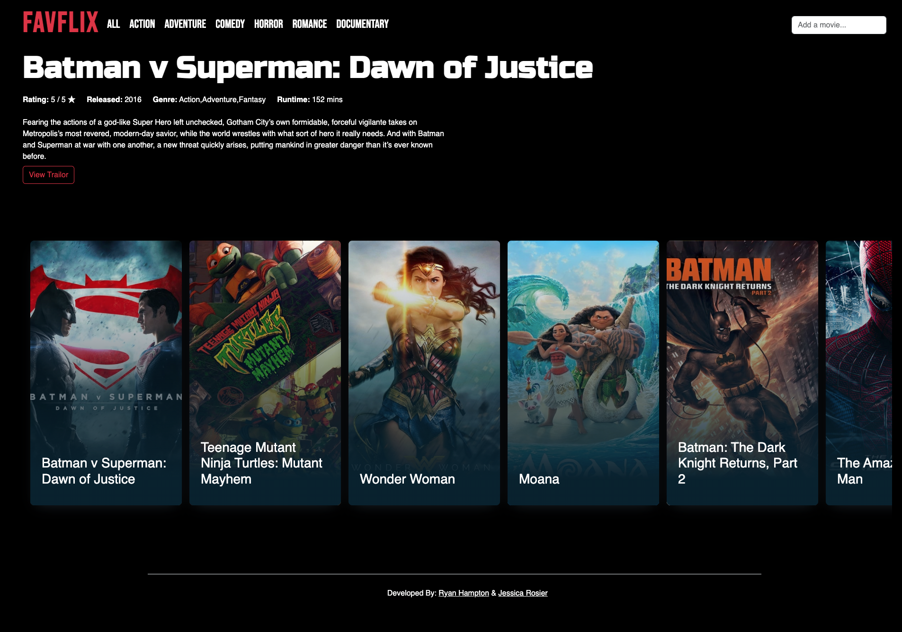

# favorite-movies-app

## Overview
This is a simple web app that allows users to search for movies and add them to a list of favorites. The app uses the [TMDB API](https://developer.themoviedb.org//) to search for movies and retrieve movie data. The app uses a local JSON database to store the list of favorite movies.

This was a pair programming development project completed in 1 week.
Check out my partner's GitHub profile [here](https://github.com/ryanhampton88)

### Screenshot

### Built with
- JavaScript
- HTML5
- Bootstrap
- custom CSS
- API integration
- NPM packages (JSON Server)

